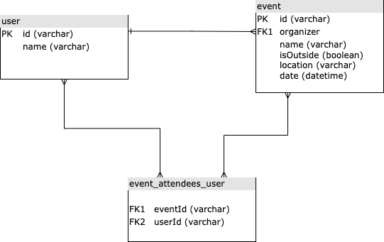

# CodingChallenge

This project was generated using [Nx](https://nx.dev).

## Setup

First setup `npm i`

Run api `WEATHER_API_KEY=<key> ng serve api`
Will need api key to get weather data. Sign up free account at [Weather API](https://www.weatherapi.com) and generate a key

Run frontend `ng serve`

## Backend API

Test endpoints [Swagger](http://localhost:3333/swagger)
`http://localhost:3333/swagger`

## Frontend

[Angular](http://localhost:4200)
`http://localhost:4200`

## ERD

## Pre setup

This repo already setup the sample data and imported into repo

Create json `npm run generateData`

Import data into sqlite `npm run importData`
This must be run after running the API which automatically run migration

For large set of data should use a queue service to import data
